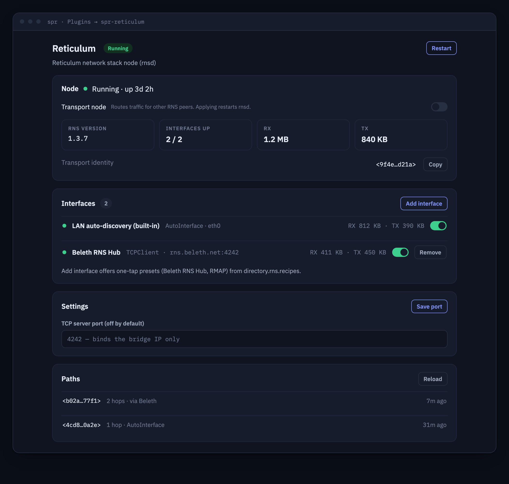

# spr-reticulum



A [Reticulum](https://github.com/markqvist/Reticulum) network stack node plugin
for [SPR (Secure Programmable Router)](https://github.com/spr-networks/super).

Reticulum is a cryptography-based networking stack for building unstoppable,
resilient mesh networks over almost any medium. This plugin runs `rnsd` (the
Reticulum daemon from the `rns` Python package) in an isolated container on
your SPR router, so your router can act as an always-on Reticulum node — and
optionally as a transport node routing traffic for other peers.

The plugin ships a Go backend that supervises `rnsd`, generates the Reticulum
config file from a validated JSON config, and serves a React UI which SPR
embeds under the Plugins section (iframe, served over the plugin's unix
socket — no network ports involved).

## Features

- Runs `rnsd` from a fully pinned, hash-checked `rns` install
- **AutoInterface** — peer with other RNS nodes over link-local IPv6 on the
  plugin's own `spr-reticulum` bridge (on by default)
- **TCPClientInterface** — connect out to any number of RNS hubs / transport
  nodes; one-click presets for community entrypoints (the original public RNS
  testnet has been decommissioned upstream — see
  [directory.rns.recipes](https://directory.rns.recipes/) for live entrypoints)
- **TCPServerInterface** — accept inbound RNS connections; **off by default**
  and only ever bound to the container IP on the plugin bridge
- **Transport toggle** — turn the node into a Reticulum transport node
  (`enable_transport`)
- Status card with node state, RNS version, per-interface status and traffic
  (parsed from `rnstatus --json`, with a text-output fallback), path table
  viewer (`rnpath`), restart button
- **Topology** — contributes its interface graph to SPR's router topology
  view (`HasTopology`): one node per enabled RNS interface with live up/down
  state, anchored to the router node
- `RNodeInterface` / serial (LoRa radios) is future work — it needs USB
  passthrough into the container

## Installation (UI)

1. In the SPR UI go to **Plugins**, click **+ New Plugin**
2. Enter this repository's URL, e.g. `https://github.com/USER/spr-reticulum`
3. Confirm — SPR clones the repo, builds the container and starts it
4. Open **Reticulum** in the plugins list

## Installation (CLI)

```bash
cd /home/spr/super/plugins/user
git clone https://github.com/USER/spr-reticulum
cd spr-reticulum
./install.sh    # prompts for SUPERDIR and an SPR API token
```

`install.sh` writes the plugin config + API token under
`configs/plugins/spr-reticulum/`, builds the image reproducibly, starts the
container and registers it on the `spr-reticulum` custom interface with
`wan,dns` policies.

## API

All endpoints are served over the plugin unix socket
(`/state/plugins/spr-reticulum/socket.sock`) and proxied by the SPR API at
`/plugins/spr-reticulum/...` (Bearer auth handled by SPR).

| Method | Path          | Description                                                          |
| ------ | ------------- | -------------------------------------------------------------------- |
| GET    | `/status`     | Node state: rnsd running, RNS version, transport on/off, interface list with per-interface status/traffic |
| GET    | `/config`     | Current JSON config                                                   |
| PUT    | `/config`     | Validate + save config, regenerate the RNS config and restart `rnsd`  |
| POST   | `/restart`    | Restart `rnsd`                                                        |
| GET    | `/path-table` | Known destination paths (`rnpath -t -j`); 503 while rnsd is down      |
| GET    | `/topology`   | Topology graph for SPR's router topology view (see below)             |

### Topology

`plugin.json` sets `"HasTopology": true`, so SPR merges the plugin's graph
into the router topology view. `GET /topology` returns
`{"Nodes": [...], "Edges": [...]}`:

- a `root` anchor node (`{"ID": "root", "ConnType": "reticulum", "Online": true}`)
  that SPR attaches to the router node
- one node per **enabled** configured interface (`Kind: "interface"`,
  `Name` = type + target, e.g. `TCPClient rns.beleth.net:4242`), with
  `Online` taken from the live `rnstatus` interface list; TCP client nodes
  carry the target host in `IP`
- one edge per interface toward `root` (`Layer: "rns"`, `Kind: "reticulum"`)

While `rnsd` is down the graph contains only the root anchor.

## Configuration

The JSON config lives at `/configs/spr-reticulum/config.json` (host:
`configs/plugins/spr-reticulum/config.json`):

```json
{
  "EnableTransport": false,
  "AutoInterfaceEnabled": true,
  "TCPClientInterfaces": [
    { "Name": "Beleth RNS Hub", "Enabled": true,
      "TargetHost": "rns.beleth.net", "TargetPort": 4242 }
  ],
  "TCPServerInterface": { "Enabled": false, "ListenPort": 4242 },
  "LogLevel": 4
}
```

| Field | Description |
| ----- | ----------- |
| `EnableTransport` | Route traffic / pass announces for other peers (default `false`) |
| `AutoInterfaceEnabled` | Link-local IPv6 peering on the plugin bridge (default `true`) |
| `TCPClientInterfaces` | Outbound connections; `Name` (letters/digits/space/`._-`, unique), `TargetHost` (hostname or IP), `TargetPort` (1-65535), `Enabled` |
| `TCPServerInterface` | Inbound listener; default off, bound to the container IP only |
| `LogLevel` | RNS log level 0-7 (default 4) |

The backend validates every field server-side (strict allow-lists, so nothing
can inject sections into the generated INI file) and renders the actual
Reticulum config to `/configs/spr-reticulum/rns.config` (reference copy) and
`/state/plugins/spr-reticulum/rns/config` (the directory `rnsd --config` runs
from). Edits to the generated files are overwritten — always change the JSON
config via the UI/API.

## Security model

- **No published host ports, no extra capabilities, no devices.** The
  container runs with `no-new-privileges:true` and talks to SPR only via the
  plugin unix socket.
- The container sits on its own docker bridge (`spr-reticulum`) with SPR
  policies `wan` + `dns` — exactly what outbound TCP interfaces need. It does
  not call the SPR API (no `ScopedPaths`, no token use at runtime).
- `TCPServerInterface` is **disabled by default**. When enabled it binds to
  the container's bridge IP only — never `0.0.0.0`, never the host. Reach it
  from LAN devices via SPR groups (`reticulum`), or keep it off.
- The only secrets are the Reticulum identity files, which live in the state
  dir (`/state/plugins/spr-reticulum/rns/storage/`); the plugin enforces
  `0600`/`0700` permissions on them. Config files are written `0600`.
- All user input is validated against allow-lists before it reaches the
  generated config; the daemon is spawned via argv arrays (no shell).

## Reproducible builds

Every build input is pinned:

- Base images (Ubuntu, Alpine, Node, SPR container template, BuildKit,
  Dockerfile syntax) by digest in `reproducible.env`
- apt packages from `snapshot.ubuntu.com` at a fixed timestamp — in the Go
  builder stage *and* for the runtime Python install
- Go toolchain by version + sha256
- `rns` and all transitive Python deps by version + sha256 in
  `requirements.txt`, installed with `pip install --require-hashes
  --only-binary :all:` (wheels only, no sdist builds); `RNS_VERSION` is
  recorded in `reproducible.env` and asserted at build time

Build with `./build_docker_compose.sh` (BuildKit `rewrite-timestamp` for
bit-for-bit output). Refresh pins with `./update-pins.sh`, which also
re-resolves the Python set via `scripts/update-python-pins.sh` (resolves
`rns` for cp312/manylinux, fetches sha256 digests from PyPI, verifies them
against a real download, and rewrites `requirements.txt`).

## Upstream

- [Reticulum](https://github.com/markqvist/Reticulum) by Mark Qvist —
  released under the Reticulum License (based on the MIT license with
  additional non-weaponization conditions); this plugin installs the
  unmodified `rns` package from PyPI at build time
- This plugin: MIT (see `LICENSE`)
